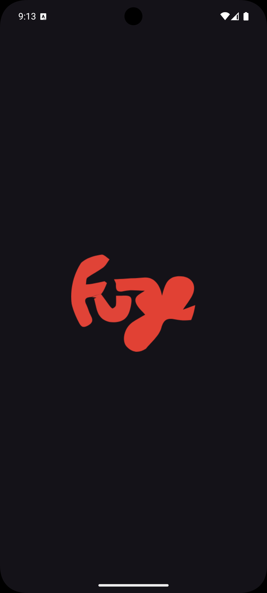
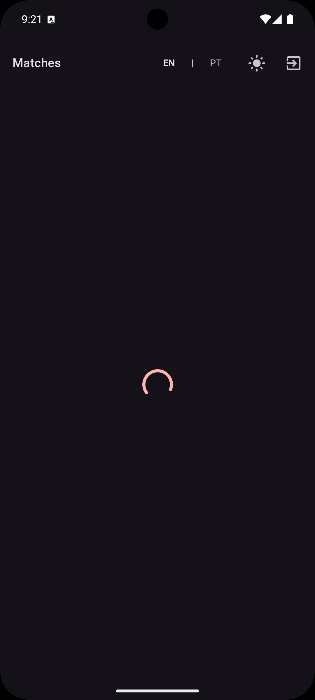
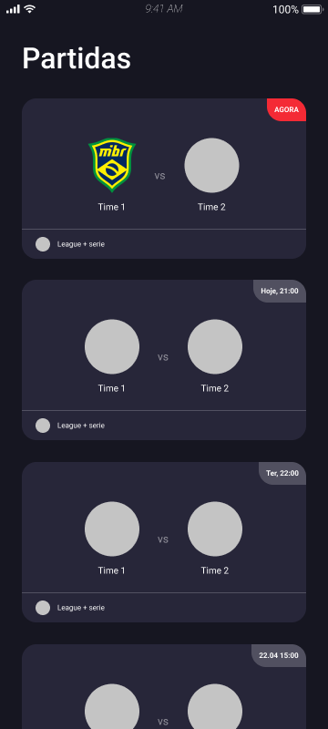
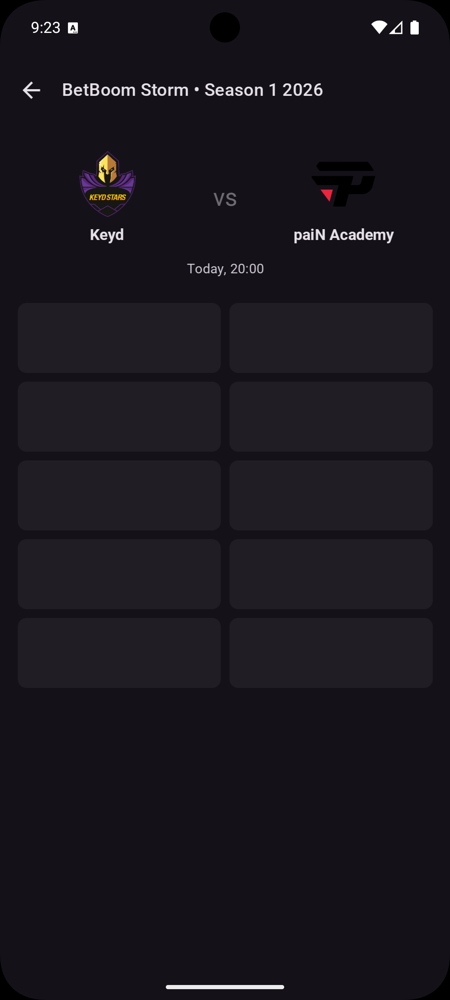
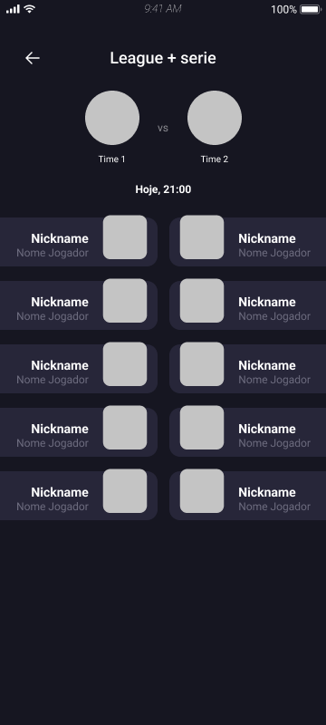

# CSTV

**Track live and upcoming Counter-Strike esports matches — powered by the PandaScore API.**

An Android app built with Jetpack Compose, Clean Architecture, and MVVM. Enter your PandaScore token once and browse running and scheduled CS matches with team info, match times, and league details. No token? Try the app in **demo mode** — no sign-up required.

-brightgreen)
-brightgreen)


[](https://github.com/denisvieiradev/cstv-android/actions/workflows/main-build.yml)

---

## Screenshots

| Splash Screen | Home (Loading) | Home |
|:---:|:---:|:---:|
|  |  |  |

| Match Details (Loading) | Match Details |
|:---:|:---:|
|  |  |

---

## Features

- Live & upcoming CS match tracking
- **Demo mode** — explore the app with limited sessions, no API key required
- **Token tutorial** — step-by-step guide to obtain and enter a PandaScore token
- **Clipboard paste** support for quick token input
- Secure API token authentication with auto-logout on 401
- Parallel data fetching for running and upcoming matches
- Dark / Light theme toggle (persisted across sessions)
- Localization: English 🇺🇸 / Portuguese 🇧🇷
- Android 12+ splash screen support
- Skeleton loading states for smooth UX

---

## Architecture

CSTV follows **Clean Architecture** with **MVVM**, organized in a multi-module structure:

```
                    ┌─────────────────────────────────────────────────┐
                    │                      :app                        │
                    │  ┌──────────┐   ┌──────────┐   ┌─────────────┐  │
                    │  │    UI    │ → │  Domain  │ → │    Data     │  │
                    │  │ Screens  │   │ UseCases │   │ Repositories│  │
                    │  │ViewModels│   │  Models  │   │ DTOs/Mappers│  │
                    │  └──────────┘   └──────────┘   └─────────────┘  │
                    └─────────────────────────────────────────────────┘
          ↓                   ↓                   ↓                   ↓
┌──────────────────┐  ┌──────────────────────┐  ┌──────────────────────┐
│  :design-system  │  │  :core:cachemanager  │  │   :core:network      │
│  CstvTheme       │  │  Hawk / SessionRepo  │  │  Retrofit/OkHttp     │
│  Components      │  │  DemoSessionManager  │  │  AuthInterceptor     │
└──────────────────┘  └──────────────────────┘  └──────────────────────┘
```

### Modules

| Module | Responsibility |
|---|---|
| `:app` | Features, domain, data layers; DI wiring |
| `:core:network` | Retrofit, OkHttp, AuthInterceptor, network utilities |
| `:core:cachemanager` | Hawk-based session/token storage backed by EncryptedSharedPreferences |
| `:design-system` | CstvTheme, reusable components (`FullScreenLoading`, `FullScreenError`, `NetworkImage`), typography, spacing |

### Key Patterns

- **Repository pattern** — data sources are abstracted behind interfaces
- **Use cases** — each business operation is encapsulated in a single-responsibility class
- **StateFlow + SharedFlow** — UI state is a `StateFlow`; one-shot navigation events use `SharedFlow`
- **Sealed classes** — screen actions and navigation events are type-safe sealed hierarchies
- **Single entry point** — all UI events go through `onAction(action: XScreenAction)` in the ViewModel
- **IO dispatcher offloading** — all data persistence operations run on `Dispatchers.IO`

---

## Tech Stack

| Library | Version | Purpose |
|---|---|---|
| Kotlin | 2.3.0 | Primary language |
| Jetpack Compose | BOM 2024.09.00 | Declarative UI |
| Material 3 | BOM-managed | Design system |
| AndroidX Lifecycle | 2.10.0 | ViewModel, LiveData |
| AndroidX Activity | 1.8.0 | Activity extensions |
| AppCompat | 1.7.1 | Backwards compatibility |
| core-ktx | 1.10.1 | Kotlin extensions |
| Koin | 4.1.1 | Dependency injection |
| Retrofit | 3.0.0 | HTTP client |
| OkHttp | 5.3.0 | HTTP logging & interceptors |
| Gson | 2.10.1 | JSON serialization |
| Coil | 2.7.0 | Async image loading |
| Hawk | 2.0.1 | Key-value cache |
| AndroidX Security Crypto | 1.1.0-alpha06 | EncryptedSharedPreferences |
| AndroidX SplashScreen | 1.0.1 | Android 12+ splash screen |
| Timber | 5.0.1 | Logging |
| Coroutines | 1.10.2 | Async / concurrency |
| JUnit 4 | 4.13.2 | Unit testing |
| MockK | 1.13.5 | Mocking |
| Turbine | 1.2.1 | Flow testing |
| Google Truth | 1.1.5 | Assertion library |

---

## Getting Started

### Prerequisites

- Android Studio Hedgehog (2023.1.1) or newer
- JDK 11
- Android emulator or physical device running API 30+
- A [PandaScore](https://pandascore.co/) API token *(optional — demo mode available)*

### Clone & Open

```bash
git clone https://github.com/denisvieiradev/cstv-android.git
cd cstv-android
```

Open the project in Android Studio (`File → Open`).

### Demo Mode

You can try the app without a PandaScore token. On the Token screen, tap **Try Demo** to enter demo mode. Demo sessions are limited; after the limit is reached the app will prompt you to enter a real token.

### API Key Setup

This app does **not** use a local config file for the API token. Instead, token entry happens at runtime:

1. Launch the app — if no token is stored you will land on the **Token screen**.
2. Follow the built-in step-by-step tutorial to obtain your PandaScore token.
3. Paste your Bearer token (clipboard paste supported) and tap **Save**.
4. The token is securely stored with `EncryptedSharedPreferences` and sent automatically on every request.

> To get a token, create a free account at [pandascore.co](https://pandascore.co/) and copy your API key from the dashboard.

### Build & Run

```bash
./gradlew assembleDebug
./gradlew installDebug
```

---

## Running Tests

```bash
# All unit tests
./gradlew testDebugUnitTest

# Single test class
./gradlew :app:testDebugUnitTest --tests "*.MatchesViewModelTest"

# Instrumented tests (requires connected device/emulator)
./gradlew connectedDebugAndroidTest
```

Tests use **MockK** for mocking, **Turbine** for Flow assertions, **Google Truth** for readable assertions, and a `MainDispatcherRule` JUnit rule to control coroutine dispatchers.

### Test Coverage

| Test File | What it covers |
|---|---|
| `MatchesViewModelTest` | Match list loading, auth error, logout |
| `MatchDetailViewModelTest` | Match detail loading and state |
| `TokenViewModelTest` | Token save, demo mode toggle |
| `DemoSessionManagerTest` | Session limits and counters |
| `GetCsMatchesUseCaseTest` | Parallel match fetching |
| `GetMatchDetailUseCaseTest` | Detail use case |
| `MatchRepositoryImplTest` | Repository logic |
| `MatchRemoteDataSourceImplTest` | API data source |
| `MatchMapperTest` | DTO → domain mapping |
| `MatchDateFormatterTest` | Match list date formatting |
| `MatchDetailDateFormatterTest` | Detail screen date formatting |
| `AuthInterceptorTest` | Token injection & 401 handling |
| `AppLoggingTest` | Logging setup |
| `FontAssetTest` | Design system font assets |
| `MatchesFlowIntegrationTest` | End-to-end flow integration |

---

## Project Structure

```
app/
└── src/main/java/com/denisvieiradev/cstv/
    ├── data/
    │   ├── datasource/       # Remote data sources
    │   ├── di/               # DataModule (Koin)
    │   ├── dto/              # API response models
    │   ├── mapper/           # DTO → Domain mappers
    │   ├── repository/       # Repository implementations
    │   └── session/          # DemoSessionManager
    ├── domain/
    │   ├── di/               # DomainModule (Koin)
    │   ├── model/            # Domain models
    │   ├── repository/       # Repository interfaces
    │   └── usecase/          # Business logic use cases
    └── ui/
        ├── di/               # UiModule (Koin)
        ├── matches/          # Match list screen + ViewModel
        ├── matchdetails/     # Match detail screen + ViewModel
        ├── splash/           # Splash / entry routing
        └── token/            # Token input screen + ViewModel

core/
├── network/                  # Retrofit, OkHttp, AuthInterceptor
└── cachemanager/             # Hawk session/token storage

design-system/                # CstvTheme, components, typography
├── components/
│   ├── button/               # PrimaryButton
│   ├── input/                # AppTextField
│   ├── image/                # NetworkImage
│   ├── maintopbar/           # MainTopBar
│   └── state/                # FullScreenLoading, FullScreenError
└── theme/                    # Colors, typography, spacing, shapes
```

---

## Contributing

1. Fork the repository
2. Create your feature branch: `git checkout -b feat/my-feature`
3. Commit your changes: `git commit -m 'feat: add my feature'`
4. Push to the branch: `git push origin feat/my-feature`
5. Open a Pull Request

---

## License

```
MIT License

Copyright (c) 2026 Denis Vieira

Permission is hereby granted, free of charge, to any person obtaining a copy
of this software and associated documentation files (the "Software"), to deal
in the Software without restriction, including without limitation the rights
to use, copy, modify, merge, publish, distribute, sublicense, and/or sell
copies of the Software, and to permit persons to whom the Software is
furnished to do so, subject to the following conditions:

The above copyright notice and this permission notice shall be included in all
copies or substantial portions of the Software.

THE SOFTWARE IS PROVIDED "AS IS", WITHOUT WARRANTY OF ANY KIND, EXPRESS OR
IMPLIED, INCLUDING BUT NOT LIMITED TO THE WARRANTIES OF MERCHANTABILITY,
FITNESS FOR A PARTICULAR PURPOSE AND NONINFRINGEMENT. IN NO EVENT SHALL THE
AUTHORS OR COPYRIGHT HOLDERS BE LIABLE FOR ANY CLAIM, DAMAGES OR OTHER
LIABILITY, WHETHER IN AN ACTION OF CONTRACT, TORT OR OTHERWISE, ARISING FROM,
OUT OF OR IN CONNECTION WITH THE SOFTWARE OR THE USE OR OTHER DEALINGS IN THE
SOFTWARE.
```
